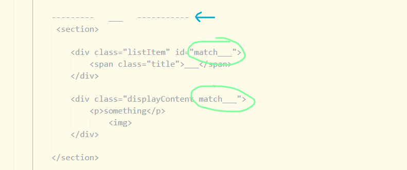
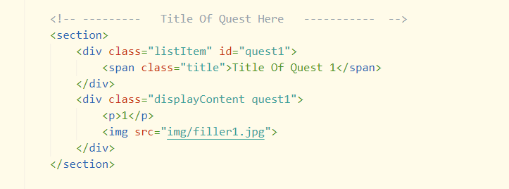

## HTML
see the ID and Class named 'match___'
these can be named anything, but must match eachother for JS to work. The JS takes the ID and adds a '.' at the beginning to find the class of that name and displays that content. Could be named the same as title, without spaces

In this next example they are both named quest 1 ✅

<strong>.listItem</strong> is the class name given to all items on left that get colored on hover/ click (named Title of Quest 1 - 5 currently )

<strong>.displayContent</strong> is the content that shows up on the screen when you click the listItem

when you use the commented out template, you have to comment out that line next to the blue arrow after pasting the template (see blue arrow in 1st pic), and (see title commented out 2nd pic)
    * this commented out title helps keep each section separated nicely once there is lots of content in each section

## CSS ##

* anything with kyu in the name will probably be renamed

* to get rid of line that separates listItems for last list item, :last-child wasn't working for some reason, so .listItem.last is used to remove that line. 
    * make sure the last item to the bottom of kyu section has .last unless someone can figure out the :last-child problem there

## JS ##

When a <strong>.listItem</strong> is clicked, JS adds a class of <strong>.stick</strong> to the div below, next to the class of <strong>.displayContent</strong>. By default <strong>.displayContent</strong> has a declaration of display: none; <strong>.stick</strong> has a declaration of display: block; which makes the content appear

I just realized that displayContent is not the best name for that class because it doesn't actually display the content lol. But, it does hold all of the style and layout for the displayed content